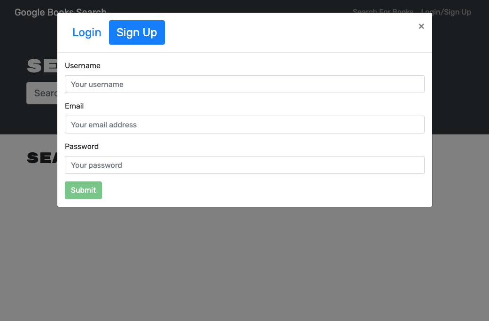

# Book Search Engine

## Table of contents

- [Description](#description)
- [Installation](#installation)
- [Usage](#usage)
- [Technologies and Languages](#technologies-and-languages)
- [Contributing](#contributing)
- [Tests](#tests)
- [License](#license)
- [Screenshots](#screenshots)
- [Deployed application](#deployed-application)
- [GitHub repository](#github-repository)
- [Questions](#questions)

---

## Description

I have been tasked to take starter code with a fully functioning Google Books API search engine built with a RESTful API, and refactor it to be a GraphQL API built with Apollo Server. The app was built using the MERN stack with a React front end, MongoDB database, and Node.js/Express.js server and API.

To complete this successfully I will need to do the following:

1. Set up an Apollo Server to use GraphQL queries and mutations to fetch and modify data, replacing the existing RESTful API.

2. Modify the existing authentication middleware so that it works in the context of a GraphQL API.

3. Create an Apollo Provider so that requests can communicate with an Apollo Server.

4. Deploy your application to Heroku with a MongoDB database using MongoDB Atlas.

---

## Installation

Start with cloning this repository link on to your local machine:

```
$ git clone https://github.com/riz1ash786/book-search-engine
$ cd book-search-engine
```

To install the required dependencies and set up the application, run:

```
$ npm i
$ npm run develop
```

---

## Usage

This application can be deployed locally or if you wish to deploy this application on Heroku then please use the link provided in the 'Deployed Application' section listed below.

---

## Technologies and Languages

<div>
&nbsp;
&nbsp;
&nbsp;
&nbsp;
&nbsp;
&nbsp;
&nbsp;
&nbsp;
&nbsp;
&nbsp;
</div>

---

[](https://github.com/riz1ash786/github-readme-stats)

## Contributing

If you are interested in contributing to this project then please feel free to get in touch with me via the contact information listed at the bottom of this README. Thank you.

---

## Tests

No tests have been specified for this application as of yet.

---

## License

 <br />
This application utilises the [ISC License](https://opensource.org/licenses/ISC "License Link")

---

## Screenshots





---

## Deployed Application

<div id="badges">
  <a href="https://github.com/riz1ash786/book-search-engine">
    
  </a>
</div>

---

## GitHub Repository

<div id="badges">
  <a href="https://github.com/riz1ash786/react-portfolio">
    
  </a>
</div>

---

## Questions

If you have any additional questions, then please feel free to get in touch via my github or email details linked below. Thank you.

<div id="badges">
  <a href="https://github.com/riz1ash786">
    
  </a> <br />
<div id="badges">
  <a href="mailto:riz1ash786@gmail.com">
    
  </a>
</div>
